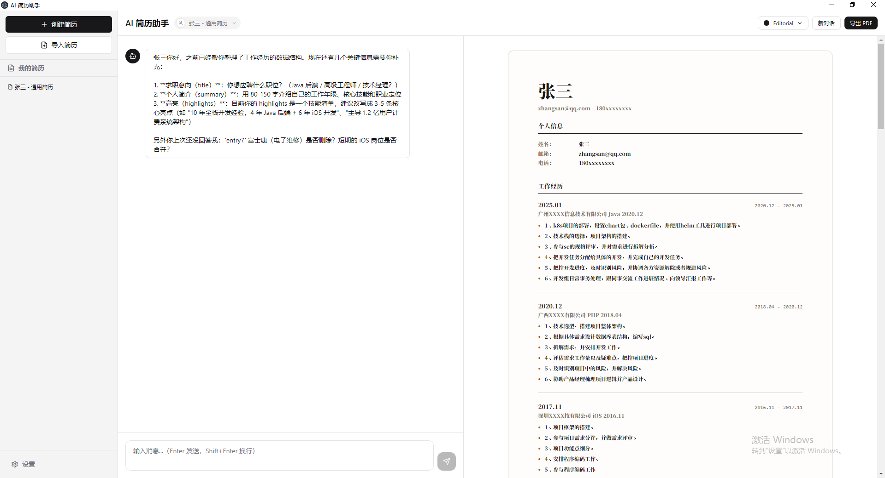
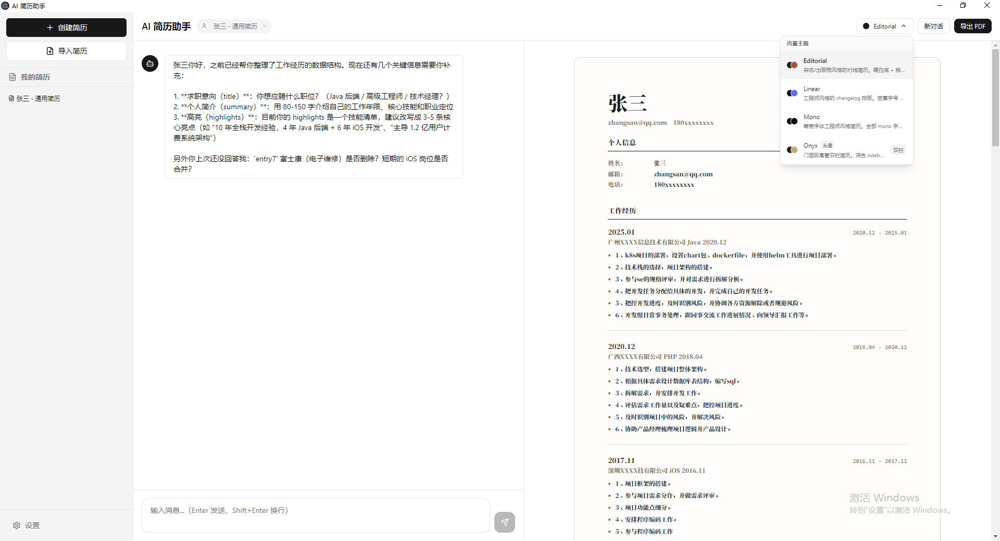
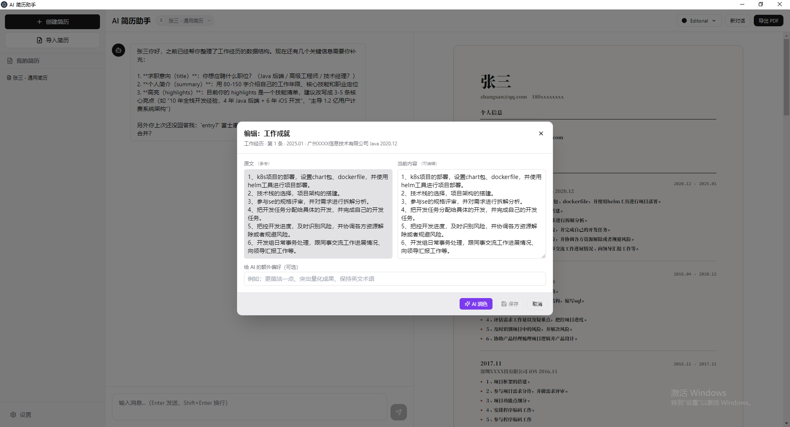

# AI 简历助手 (Resume AI Assistant)

> 打开即用的桌面级 AI 简历工具：和 AI 聊几句，就能产出一份排版精美的 PDF 简历。

AI 简历助手是一款基于 Electron + React 构建的桌面应用，把「写简历」这件事从「面对空白文档焦虑」变成「和 AI 聊聊天」。AI 会主动问你需要的信息，你只要回答，右边实时渲染出一份排版专业的简历，随时可导出 PDF。

应用内嵌 Opencode SDK 作为 LLM 网关（默认使用 `big-pickle` 等免费模型），无需用户配置 API Key；同时把对话产生的结构化数据完整保存在本地，确保简历隐私不外泄。

## 项目截图

<!-- TODO: 替换为实际截图 -->
<!-- 截图 1: 主界面（左聊天 / 右实时预览） -->


<!-- 截图 2: 主题切换器下拉，展示 4 套 v3 主题 -->


<!-- 截图 3: AI 润色流程，顶部 Toast 提示 + 对话气泡中显示挑刺式建议 -->


---

## 核心价值叙事

### 痛点：写简历这件小事，难住了大多数人

- **空白文档恐惧**：打开 Word 模板，看着「请填写工作经历」就关掉了。
- **不会措辞**：明明做了很多事，写出来却像流水账，HR 一秒略过。
- **排版耗时**：好不容易写完内容，又花两小时调字号、行距、分页。
- **工具门槛高**：想用 AI 帮忙，结果要注册、要绑卡、要会写 prompt。

### 解法：把「写简历」变成「聊简历」

AI 简历助手重新设计了简历流程：

1. **AI 主动提问**：不需要你想「要写什么」，AI 读完模板字段后主动问你。
2. **实时可视化**：你每回答一条，右侧预览立即更新；所见即所得。
3. **AI 润色循环**：不满意？点「AI 润色」，AI 化身挑刺官，对每个字段给出可执行的改写方向。
4. **多套专业主题**：导出前可一键切换 4 套 v3 主题（Onyx 高管风 / Mono 极简风 / Linear 横线风 / Editorial 编辑风），排版细节由主题 JSON 控制。
5. **导入老简历**：拖入已有 PDF/文本简历，AI 自动解析+结构化，省去从零开始的痛苦。

### 对比传统方式

| 维度 | 传统 Word 模板 | 通用 AI 聊天 | **AI 简历助手** |
|---|---|---|---|
| 上手成本 | 自己读模板说明 | 自己组织 prompt | 打开就聊 |
| 内容采集 | 手工搬运 | 自由发挥易跑题 | 模板字段驱动，必填项不遗漏 |
| 排版 | 自己调 | 不可控 | 4 套专业主题 + 实时预览 |
| 润色 | 自己挑刺 | 一次性 | 多轮循环 + 字段级建议 |
| 隐私 | 本地但散乱 | 上传到云端 | 本地结构化保存 |
| 导出 | 手工另存 | 复制粘贴 | 一键 PDF |

### 一次完整流程的循环

```
        ┌──────────────────────────┐
        │   创建 / 打开 / 导入简历   │
        └────────────┬─────────────┘
                     ▼
        ┌──────────────────────────┐
        │  AI 主动问字段（模板驱动）  │
        └────────────┬─────────────┘
                     ▼
        ┌──────────────────────────┐
        │     用户回答 / 补充       │
        └────────────┬─────────────┘
                     ▼
        ┌──────────────────────────┐
        │ 提炼结构化数据 → 更新预览  │
        └────────────┬─────────────┘
                     ▼
        ┌──────────────────────────┐
        │  切换主题 / 手动微调 /    │
        │   点 AI 润色（循环）       │◀──────┐
        └────────────┬─────────────┘       │
                     ▼                      │
        ┌──────────────────────────┐       │
        │    满意 → 导出 PDF       │       │
        └──────────────────────────┘       │
                                            │
              不满意 ───────────────────────┘
```

---

## 特性清单

- **零门槛上手** — 桌面应用一打开即用，无需注册账号、无需配置 API Key
- **对话式采集** — AI 根据简历模板字段主动发问，不遗漏必填项
- **实时预览** — 回答一句、右侧预览刷新一句，所见即所得
- **多套数据模板** — 内置通用 / 技术 / 管理 三套简历数据模板
- **4 套 v3 视觉主题** — Onyx、Mono、Linear、Editorial，覆盖极简到高管的不同风格
- **AI 润色循环** — 多次润色不重样，字段级挑刺+可执行改写方向
- **PDF 导入解析** — 拖入老 PDF / 文本简历，AI 自动结构化为模板字段
- **PDF 风格提取** — 解析老简历时同时提取视觉风格，「青出于蓝」套用更优排版
- **多份简历管理** — 左侧栏可创建、切换、删除多份简历，每份独立持久化
- **本地隐私优先** — 简历数据存本地（开发模式在项目根，打包后与 exe 同目录），LLM 通信由主进程管理，API Key 不暴露
- **便携安装** — 数据与 exe 同目录，可整体迁移到任意盘符/U 盘运行
- **暗 / 亮色 UI** — 跟随系统或手动切换（`Cmd/Ctrl + ,` 打开设置）
- **快捷键** — `F12` 打开 DevTools，`Cmd/Ctrl + ,` 打开设置

---

## 小白使用教程

> 这一节面向第一次使用本应用、不会写代码的小白用户。按顺序读完即可独立完成一份专业简历。

### 1. 下载安装

#### 方式 A：使用安装包（推荐）

1. 进入项目的 [Releases 页面](https://github.com/stccon/work-resume/releases) 下载最新安装包（Windows 平台为 `AI简历助手-Setup-x.x.x.exe`）。
2. 双击安装包，按向导选择安装位置（建议非系统盘）。
3. 安装完成后从桌面或开始菜单启动「AI 简历助手」。

#### 方式 B：开发模式启动

如果你电脑装了 Node.js（版本 ≥ 18），也可以直接跑源码：

```bash
git clone <仓库地址>
cd work-resume
npm install
npm run electron:dev
```

> **国内用户注意：** 仓库已内置 `.npmrc` 配置了 `npmmirror.com` 镜像，`npm install` 会自动走国内镜像下载 Electron 二进制（~100MB）和所有依赖，无需额外设置。

### 2. 首次启动

应用启动后会出现「欢迎引导」界面，介绍主界面布局。读完点「知道了」即可进入主界面。

主界面三大区域：

- **左侧栏**：简历列表、创建/导入按钮
- **中间聊天区**：和 AI 对话
- **右侧预览区**：简历实时渲染

### 3. 创建第一份简历

点击左侧栏的「创建简历」按钮，应用会立刻保存一份空简历并触发 AI 的开场白。AI 一般会问：

- 「请问你叫什么名字？」
- 「你想应聘什么岗位？」

### 4. 跟着 AI 一步步对话

根据 AI 的提问逐项回答即可。AI 提问的顺序是模板字段定义的顺序：

1. **个人信息** — 姓名、求职意向、邮箱、电话、所在城市
2. **个人简介** — 80-150 字自我介绍
3. **个人优势** — 3-5 条核心亮点
4. **专业技能** — 编程语言、框架、数据库、软技能
5. **工作经历** — 每段经历的公司、职位、时间、职责、业绩
6. **项目经历** — 项目背景、你的角色、关键成果
7. **教育背景** — 学校、专业、学历、时间
8. **奖项 / 证书** — 选填

回答完一轮，右侧预览会立即刷新。**任何时候你都可以直接修改右侧预览中的文字**，AI 也能感知到修改并继续优化。

### 5. 实时预览 & 一键 AI 润色

对当前内容不满意？点击顶部「AI 润色」按钮，AI 会化身挑刺官，针对每个字段给出 1-3 条具体建议（动词弱、缺量化、缺关键词等），并直接改写。

润色按钮可重复点击；累计到 4 次时应用会提示「建议先导出 PDF 看看实际效果，避免无脑润色」。

### 6. 切换视觉主题

顶部下拉菜单中可选择 4 套 v3 主题，每套对应不同的排版风格：

| 主题 | 风格描述 | 适合场景 |
|---|---|---|
| **Onyx** | 深色 sidebar + 金色 accent + 大尺寸头像 | 资深岗位、董事/VP/管理层 |
| **Mono** | 极简单栏、纯净排版 | 设计师、研发岗 |
| **Linear** | 横线分割、几何感强 | 工程师、产品经理 |
| **Editorial** | 编辑风、强调字号对比 | 媒体、运营、市场 |

切换主题后，预览立即刷新，导出 PDF 也会使用新主题。

### 7. 导入老简历

如果你已经有一份 PDF 或文本简历，可以直接拖到左侧栏的「上传简历」区域，或点击上传按钮选择文件。

- **PDF 简历**：AI 自动提取文字 + 提取头像（如果有）+ 解析为结构化字段
- **文本简历（.txt）**：直接发给 AI 整理

导入完成后，AI 会主动指出 1-2 个常见缺失或可疑字段（例如联系方式缺位、时间线异常），引导你补充。

### 8. 导出 PDF

满意后，点击顶部「导出 PDF」按钮，选择保存位置。文件命名规则：

```
{姓名}_{模板标签}_{日期}.pdf
例如：张三_通用简历_2026-06-06.pdf
```

PDF 默认保存到应用的 `resumes/` 目录（开发模式在项目根的 `resumes/`，打包后在与 exe 同目录的 `resumes/`）。

### 9. 多份简历管理

左侧栏可创建多份简历（应对不同岗位投递），随时切换：

- **创建新简历**：点「+ 创建简历」
- **切换简历**：点击列表项
- **删除简历**：右键或悬停显示删除按钮

每份简历有独立的对话历史、模板、视觉主题、头像。

### 10. 常见问题

#### Q: 提示「Opencode 未连接 · 重试」？

应用启动时会自动拉起 Opencode 子进程作为 LLM 网关。偶尔因端口冲突启动失败，点「重试」即可。仍失败请检查是否已安装 `opencode` 命令（`opencode --version` 验证）。

#### Q: 提示「Token 配额不足，请充值后重试」？

默认模型为 Opencode 免费层，配额用尽后会触发该提示。点击 Toast 中的「去充值」按钮跳转到 Opencode 官网即可。

#### Q: PDF 解析失败？

少数扫描版 PDF 是图片格式，无法直接提取文字。遇到这种情况应用会提示「无法自动解析此 PDF」，你可以：

- 切换为文本简历（.txt）
- 手动在对话里告诉 AI 你的经历，让 AI 帮你整理

#### Q: 数据存在哪里？安全吗？

所有简历数据保存在本机：

- **开发模式**：项目根的 `templates/`、`themes/`、`resumes/`，`config.json` 也放在项目根
- **打包后**：与 exe 同目录的 `templates/`、`themes/`、`resumes/`、`config.json`、`logs/`

数据完全本地，不会上传到云端。LLM 调用走的是本地子进程通道，简历内容仅作为 prompt 发送给模型服务商。

由于数据与 exe 同目录，整个安装目录可整体剪切到 D 盘、U 盘任意位置运行，配置和简历都不会丢。

---

## 开发者使用教程

> 这一节面向想参与开发、定制、二次分发本项目的工程师。

### 1. 环境要求

- **Node.js** ≥ 18（推荐 20 LTS）
- **包管理器**：npm（仓库已带 `package-lock.json`）或 pnpm
- **操作系统**：Windows 10/11、macOS 12+、主流 Linux 发行版
- **磁盘**：开发模式约 1.5 GB（含 Electron + opencode 二进制）
- **Opencode**：开发期 `npm install` 会自动安装 `opencode-ai` 及匹配当前平台的原生二进制；打包时该二进制会随应用分发

### 2. 快速开始

```bash
git clone <仓库地址>
cd work-resume
npm install
npm run electron:dev
```

> **国内用户注意：** 仓库已内置 `.npmrc`，自动走 `npmmirror.com` 镜像下载 Electron 二进制和所有依赖，`npm install` 一行命令即可，无需额外配置。

`electron:dev` 脚本会同时启动 Vite 开发服务器和 Electron 主进程，渲染进程代码改动会自动热更新。

### 3. 项目目录结构

```
work-resume/
├── electron/                  # 主进程（Node.js）
│   ├── main.ts                # 应用入口、窗口管理
│   ├── preload.ts             # 桥接层，向渲染进程暴露 window.electronAPI
│   ├── ipc.ts                 # IPC 通道注册
│   ├── opencode.ts            # Opencode 子进程拉起 + SDK 调用
│   ├── resume-parser.ts       # PDF 解析
│   ├── pdf-extractor.ts       # PDF 文本提取
│   ├── pdf-image-extractor.ts # PDF 头像提取
│   ├── pdf-theme-extractor.ts # PDF 风格分析
│   ├── template-mapper.ts     # 模板字段映射
│   ├── paths.ts               # 用户数据目录解析
│   ├── migration.ts           # 旧数据迁移
│   ├── imported-themes.ts     # 导入主题管理
│   └── __tests__/             # 主进程单元测试
│
├── src/                       # 渲染进程（React）
│   ├── App.tsx                # 根组件
│   ├── main.tsx               # 渲染入口
│   ├── adapter/               # LLM 适配层
│   │   ├── ChatAdapter.ts         # 抽象接口
│   │   ├── OpencodeAdapter.ts     # 当前实现
│   │   ├── distillation.ts        # 模板字段 → prompt 构造
│   │   ├── polish.ts              # 润色 prompt
│   │   ├── style-analyzer.ts      # 风格分析 prompt
│   │   ├── style-applier.ts       # 风格应用
│   │   └── template-context.ts    # 模板上下文
│   ├── components/            # React 组件
│   │   ├── Sidebar.tsx            # 左侧栏
│   │   ├── ChatInput.tsx          # 聊天输入
│   │   ├── ChatMessage.tsx        # 聊天消息
│   │   ├── ResumePreview.tsx      # 简历预览
│   │   ├── EditableResumePreview.tsx # 可编辑预览
│   │   ├── FileUpload.tsx         # 文件上传
│   │   ├── SettingsDialog.tsx     # 设置弹窗
│   │   ├── VisualThemePicker.tsx  # 主题选择
│   │   ├── TemplatePreview.tsx    # 模板预览
│   │   ├── WelcomeGuide.tsx       # 欢迎引导
│   │   ├── Toast.tsx              # 全局通知
│   │   ├── ErrorBoundary.tsx      # 错误边界
│   │   ├── ResumeNamePill.tsx     # 简历名+头像 pill
│   │   ├── FieldEditorDialog.tsx  # 字段编辑弹窗
│   │   └── OptimizationResult.tsx # 优化结果展示
│   ├── lib/                   # 工具库
│   │   ├── resume-generator.ts    # 简历数据生成
│   │   ├── resume-renderer.ts     # 简历渲染
│   │   ├── resume-analysis.ts     # 简历分析
│   │   ├── text-diff.ts           # 文本 diff
│   │   ├── field-locator.ts       # 字段定位
│   │   ├── field-context.ts       # 字段上下文
│   │   ├── baseline-grid.ts       # 排版基线网格
│   │   ├── avatar-utils.ts        # 头像工具
│   │   ├── monogram.ts            # 字母组合头像
│   │   └── utils.ts               # 通用工具
│   ├── stores/                # 状态管理（zustand）
│   ├── styles/                # 全局样式
│   ├── types/                 # TypeScript 类型定义
│   └── __tests__/             # 渲染进程单元测试
│
├── templates/                 # 数据模板（Layer 1：定义「问什么」）
│   ├── general.json
│   ├── technical.json
│   ├── management.json
│   ├── index.ts
│   └── _archived_v1_v2/       # 历史版本（已弃用）
│
├── themes/                    # 视觉主题（Layer 2：定义「长什么样」）
│   ├── index.ts
│   ├── v3-editorial.json
│   ├── v3-linear.json
│   ├── v3-mono.json
│   └── v3-onyx.json
│
├── openspec/                  # 设计文档与变更记录
│   ├── config.yaml
│   ├── specs/                 # 当前能力规格
│   └── changes/               # 变更提案（proposal/design/tasks）
│
├── resumes/                   # 导出的 PDF 存放目录
├── resources/                 # 静态资源（图标等）
├── doc/                       # 中文需求文档
│
├── package.json
├── vite.config.ts             # Vite + Electron 插件配置
├── vitest.config.ts           # 单元测试配置
├── electron-builder.yml       # 打包配置（NSIS）
├── tailwind.config.ts         # Tailwind CSS 配置
├── postcss.config.js
├── tsconfig.json
├── tsconfig.node.json
├── components.json            # Shadcn/ui 配置
└── index.html                 # 渲染进程 HTML 入口
```

### 4. npm scripts 全表

| 命令 | 作用 |
|---|---|
| `npm run dev` | 启动 Vite 开发服务器（仅渲染进程，不含 Electron 主进程） |
| `npm run electron:dev` | **推荐开发命令**，同时启动 Vite + Electron 主进程 |
| `npm run build` | 渲染进程生产构建（输出到 `dist/`） |
| `npm run electron:build` | 全量打包：渲染进程 + Electron 主进程 + NSIS 安装包（输出到 `release/`） |
| `npm run preview` | 本地预览生产构建产物 |
| `npm run typecheck` | TypeScript 类型检查（`tsc --noEmit`） |
| `npm test` | 运行单元测试（vitest，单次） |
| `npm run test:watch` | 单元测试 watch 模式 |
| `npm run postinstall` | **自动跑**：`npm install` 后自动 patch `node_modules/` 内 7za 与 builder-util（详见 6.4） |

### 5. 运行单元测试

```bash
npm test
```

测试使用 [Vitest](https://vitest.dev/)，覆盖范围：

- `src/__tests__/`：渲染进程核心逻辑（distillation / polish / field-locator / monogram / text-diff / resume-generator / template / 全部 4 套 v3 主题 / 集成测试）
- `electron/__tests__/`：主进程逻辑

### 6. 打包发布

#### 6.1 一键打包

```bash
npm run electron:build
```

等价于 `vite build && electron-builder`，依次完成：

1. Vite 构建渲染进程到 `dist/`
2. Vite 构建 Electron 主进程 + preload 到 `dist-electron/`
3. electron-builder 读取 `electron-builder.yml`，把 `dist/` + `dist-electron/` + `templates/` + `themes/` + `node_modules/opencode-ai/bin/` 打成 NSIS 安装包

产物输出到 `release/` 目录，Windows 下文件名 `AI简历助手 Setup 1.0.0.exe`（约 240 MB）。

#### 6.2 数据目录与"便携安装"

打包后的应用**所有运行时数据都写在 exe 同级目录**：

```
D:\Apps\AI简历助手\                  ← 你选的安装位置
├── AI简历助手.exe                   ← 主程序
├── templates\general.json           ← 数据模板（首次启动从安装包复制）
├── themes\v3-*.json                 ← 视觉主题（同上）
├── resumes\xxx_通用_2026-06-06.pdf  ← 你导出的简历
├── config.json                      ← 简历列表 / API Key / 当前模型 / UI 主题
├── logs\debug-2026-06-06.log        ← 运行日志
└── resources\opencode-ai\bin\opencode.exe
```

实现方式：把 `app.getPath("userData")` 替换为 `path.dirname(app.getPath("exe"))`（`electron/paths.ts`）。**整个目录可整体迁移到任意盘符、U 盘**——剪切到 `E:\` 后从 `E:\AI简历助手\AI简历助手.exe` 直接启动，数据全部还在。

NSIS 安装时 `perMachine: false`（`electron-builder.yml`），默认装到 `%LOCALAPPDATA%\Programs\AI简历助手\`，**也是可写目录**。如果手动指定安装到 `C:\Program Files\`，exe 旁不可写，会自动降级到系统 `userData`。

升级覆盖安装时**数据不会丢**；如需完全卸载，删除整个安装目录即可。

#### 6.3 国内网络环境的镜像

项目通过两种方式解决国内下载慢的问题：

##### 开发期（npm install）

仓库根目录的 `.npmrc` 已配置：

```ini
registry=https://registry.npmmirror.com/
electron_mirror=https://npmmirror.com/mirrors/electron/
```

- `registry` — npm 包下载走国内镜像
- `electron_mirror` — `electron` 包的 postinstall 脚本通过 `@electron/get` 读取此配置，从国内镜像下载 Electron 二进制（~100MB）

此外，`opencode-ai` 自身已声明了全平台原生二进制（`opencode-windows-x64`、`opencode-darwin-arm64` 等共 12 个）作为 `optionalDependencies`，且每个包在其 `package.json` 中标注了 `os` 和 `cpu`（如 `{ os: ["win32"], cpu: ["x64"] }`）。npm 在安装时会自动过滤——**只下载匹配当前平台的包**，不会跨平台下载无用二进制。`opencode-ai` 的 postinstall 运行时通过 `require.resolve()` 找到对应平台的二进制，避免嵌套 `npm install` 导致的静默卡顿。

**国内用户一行命令即可：**

```bash
npm install
```

##### 打包期（electron-builder）

打包时 electron-builder 下载 Electron 和签名工具走不同配置。在 `package.json` 的 `build` 字段下加：

```json
"build": {
  "electronDownload": { "mirror": "https://npmmirror.com/mirrors/electron/" },
  "electronBuilderBinariesMirror": "https://npmmirror.com/mirrors/electron-builder-binaries/"
}
```

或者临时用环境变量：

```powershell
$env:ELECTRON_MIRROR = "https://npmmirror.com/mirrors/electron/"
$env:ELECTRON_BUILDER_BINARIES_MIRROR = "https://npmmirror.com/mirrors/electron-builder-binaries/"
npm run electron:build
```

#### 6.4 node_modules 临时补丁（自动）

由于 **Windows 普通用户没有 `SeCreateSymbolicLinkPrivilege`**，electron-builder 内部 7za 在解压 `winCodeSign` 归档时会因 darwin 子目录的符号链接而失败。`scripts/postinstall.mjs` 在 `npm install` 完成后自动做两个改动：

1. `node_modules/7zip-bin/win/x64/7za.exe` → `7za-real.exe`，新增 `7za.bat` wrapper 强制加 `-snl-`（禁用符号链接）
2. `node_modules/builder-util/out/util.js` 的 `exec()` 路由 `.bat/.cmd` 通过 `cmd /c`

幂等可重跑：再次 `npm install` 时脚本会检测已 patch 不重复。如果未来升级 `electron-builder` 后 7za 路径或 `util.js` 结构变化，patch 可能失效，对应 log `[postinstall] SKIP: ...`。

#### 6.5 手工验证清单

打包成功后建议做这几步检查：

1. 安装到非系统盘（如 `D:\Apps\AI简历助手\`）
2. 启动应用，确认主窗口出现
3. 检查 `D:\Apps\AI简历助手\templates\general.json`、`themes\v3-*.json`、`config.json`、`logs\` 均已生成
4. 编辑一份简历 → 导出 PDF → `resumes\xxx.pdf` 出现
5. 关闭应用，**整个 `D:\Apps\AI简历助手\` 目录**剪切到 `E:\Test\`，从 `E:\Test\AI简历助手.exe` 启动，简历数据仍在（验证 self-contained）
6. 启动第二个实例 → 第一个窗口应被唤起，第二个进程退出（单实例锁验证）

#### 6.6 自定义打包

编辑 `electron-builder.yml`：

- `appId` — 应用唯一 ID（如 `com.yourcompany.resume`）
- `productName` — 安装包与快捷方式显示名
- `icon` — 应用图标（建议 256×256 以上 PNG/ICO）
- `win.target` — `nsis`（推荐）/ `msi` / `portable`
- `directories.output` — 产物输出目录（默认 `release/`）

### 7. 扩展指南

#### 7.1 新增数据模板

数据模板（Layer 1）定义「AI 问什么、字段是什么、是否必填、字段顺序」。

1. 在 `templates/` 下新增 `your-template.json`，结构参考 `general.json`：

```json
{
  "name": "your-template",
  "label": "你的模板名",
  "description": "适用场景说明",
  "sections": [
    {
      "id": "personal",
      "label": "个人信息",
      "fields": [
        { "id": "name", "label": "姓名", "type": "text", "required": true, "order": 1, "prompt": "请问你的姓名是？" }
      ]
    }
  ]
}
```

2. 模板会在应用启动时自动被主进程扫描（`electron/main.ts` → `copyJsonDir`），无需手动注册。

字段类型支持：`text` / `textarea` / `skills` 等。

#### 7.2 新增视觉主题

视觉主题（Layer 2）定义「颜色、字体、版式、头像位置」。

1. 在 `themes/` 下新增 `v3-your-theme.json`：

```json
{
  "name": "v3-your-theme",
  "label": "你的主题",
  "description": "主题描述",
  "hasAvatar": false,
  "typeFamily": "sans",
  "layout": "single-column",
  "colors": {
    "primary": "#1a1a1a",
    "accent": "#ff6363",
    "background": "#ffffff",
    "surface": "#f5f5f5",
    "border": "#e5e5e5",
    "muted": "#737373",
    "text": "#1a1a1a"
  },
  "fonts": { "heading": "...", "body": "...", "mono": "..." },
  "typography": { "name": {...}, "title": {...}, "sectionTitle": {...}, "body": {...} },
  "spacing": { "pagePadding": "32px", "sectionGap": "24px", "entryGap": "16px" },
  "baseline": 8,
  "density": "spacious"
}
```

2. 主题通过 `import.meta.glob` 在 `themes/index.ts` 中自动扫描，**只要文件名匹配 `v3-*.json` 就会自动出现在主题选择器里**。

#### 7.3 替换 LLM 后端

应用通过 `ChatAdapter` 接口与 LLM 解耦（`src/adapter/ChatAdapter.ts`）：

```typescript
export interface ChatAdapter {
  sendMessage(text: string, callbacks: StreamCallbacks): Promise<void>
  abort(): void
  getModels(): Promise<string[]>
  setModel(model: string): Promise<void>
  getCurrentModel(): Promise<string>
}
```

当前实现是 `OpencodeAdapter`（`src/adapter/OpencodeAdapter.ts`）。要替换为自建后端：

1. 新建 `src/adapter/YourAdapter.ts`，实现 `ChatAdapter` 接口
2. 在 `App.tsx` 中替换 `OpencodeAdapter` 实例化为你的实现
3. 主进程 `electron/opencode.ts` 中的子进程拉起逻辑可移除或保留为 fallback

抽象层的设计目的是：未来可同时支持 Opencode 公共模型 + 自建后端私有模型，UI 侧无需改动。

### 8. 调试技巧

- **F12**：在主窗口内按 `F12` 打开 Chromium DevTools，查看渲染进程日志、断点 React 组件
- **`logs/` 目录**：主进程日志通过 `electron/logger.ts` 写入 `logs/`
- **IPC 通道**：所有 IPC 通道在 `electron/ipc.ts` 集中注册；渲染进程通过 `window.electronAPI.xxx` 调用，类型定义在 `src/env.d.ts`
- **重置本地数据**：开发模式删除项目根的 `config.json`、`resumes/`、`logs/`；打包后删除安装目录下的 `config.json`、`resumes/`、`logs/`（如需彻底清理，包括 `templates/` 和 `themes/` 也会被删，下次启动会从安装包重新复制）
- **手动测试 LLM 流式输出**：`src/App.tsx` 的 `streamResponse` 函数中 `onChatChunk` 回调可断点

### 9. 代码规范与约束

- **TypeScript 严格模式**：所有新增文件必须显式声明类型，避免 `any`
- **不写注释**：除非业务逻辑复杂到不写无法理解，遵循仓库「DO NOT ADD ANY COMMENTS unless asked」约定
- **OpenSpec 工作流**：所有跨模块的变更（新增能力、修改接口）需先在 `openspec/CHANGES/<日期-能力名>/` 写 proposal / design / tasks 三个文档
- **Tailwind 优先**：样式一律走 Tailwind utility class，避免新增 CSS 文件
- **React 19 + 命名导出**：组件用 `export function Comp()` 而非默认导出，便于 tree-shaking

---

## 技术架构

### 整体架构

```
┌──────────────────────────────────────────────────────────────┐
│ Renderer Process (React + TypeScript)                          │
│                                                                │
│  App.tsx (UI 状态机)                                            │
│    ├─ Sidebar / ChatInput / ChatMessage / ResumePreview        │
│    ├─ VisualThemePicker / SettingsDialog                       │
│    └─ ChatAdapter (接口)                                        │
│         └─ OpencodeAdapter (当前实现)                            │
│              │                                                  │
│              ▼ window.electronAPI.*                             │
├──────────────────────────────────────────────────────────────┤
│ Preload (electron/preload.ts)                                   │
│   - contextBridge 暴露 IPC 调用                                  │
├──────────────────────────────────────────────────────────────┤
│ Main Process (electron/*.ts)                                    │
│   - main.ts: 窗口管理、菜单                                       │
│   - ipc.ts: IPC 通道注册                                         │
│   - opencode.ts: Opencode 子进程拉起 + SDK 调用                   │
│   - resume-parser.ts / pdf-extractor.ts / pdf-image-extractor   │
│   - paths.ts: 用户数据目录解析                                    │
│   - migration.ts: 旧数据迁移                                     │
│              │                                                  │
│              ▼ spawn                                            │
├──────────────────────────────────────────────────────────────┤
│ Opencode 子进程 (opencode-ai/bin/opencode serve)                │
│   - 作为 LLM 网关，支持多模型切换                                  │
│   - API Key 由子进程持有，不暴露给前端                             │
└──────────────────────────────────────────────────────────────┘
```

### 三大目录职责

| 目录 | 职责 | 写入方 |
|---|---|---|
| `templates/` | **数据模板**（Layer 1）：字段定义、对话 prompt 源 | 开发者新增；用户只读 |
| `themes/` | **视觉主题**（Layer 2）：颜色、字体、版式、头像 | 开发者新增；用户只读 |
| `resumes/` | **导出 PDF**：最终产出 | 应用自动写入 |

应用运行时还会生成（均在**应用根目录**——dev 时是项目根，打包后是 exe 所在目录）：

| 文件/目录 | 职责 | 写入方 |
|---|---|---|
| `config.json` | electron-store：简历列表、API Key、当前模型、UI 主题 | 应用自动写入 |
| `logs/debug-YYYY-MM-DD.log` | 主进程日志 | 应用自动写入 |
| `themes/imported-*.json` | 用户从 PDF 提取并保存的视觉主题 | 用户触发保存 |
| `resumes/*.pdf` | 导出的简历 PDF | 用户触发导出 |

### Adapter 分层

```
UI Layer (App.tsx)
   ↓ 依赖接口
ChatAdapter (src/adapter/ChatAdapter.ts)
   ↓ 实现
OpencodeAdapter (src/adapter/OpencodeAdapter.ts)
   ↓ 封装
@opencode-ai/sdk
   ↓ spawn
Opencode 子进程
```

未来可新增 `DirectApiAdapter`（直接对接自建后端），UI 层无感切换。

### v3 视觉主题系统

`themes/v3-*.json` 是 4 套主题，对应 4 套典型排版风格：

| 主题 | layout | 风格 | 头像 | 适合 |
|---|---|---|---|---|
| `v3-onyx` | two-column | 深色 sidebar + 金色 accent | 大尺寸 | 资深岗位、董事/VP/管理层 |
| `v3-mono` | single-column | 极简、纯净排版 | 无 | 设计师、研发 |
| `v3-linear` | single-column | 横线分割、几何感 | 无 | 工程师、产品经理 |
| `v3-editorial` | two-column | 编辑风、强调字号对比 | 中尺寸 | 媒体、运营、市场 |

主题 JSON 主要字段：

- `colors` — 主色、强调色、背景、文本
- `fonts` — 标题 / 正文 / 等宽字体栈
- `typography` — 姓名、标题、正文等的字号字重
- `layout` — `single-column` / `two-column`
- `density` — `compact` / `comfortable` / `spacious`
- `avatar` — 头像位置、尺寸、形状
- `baseline` — 排版基线网格（默认 8px）

新增主题只需在 `themes/` 放一个 `v3-xxx.json`，无需改任何代码即可被应用识别。

---

## 路线图 / 已知问题

**当前阶段（阶段 1）已完成：**

- Electron + React + TypeScript 基础架构
- Opencode SDK 接入与多模型切换
- 4 套 v3 视觉主题
- PDF 导入 + 结构化解析 + 头像提取 + 视觉风格提取
- AI 润色循环与字段级建议
- 多份简历本地持久化

**已知限制：**

- 仅 Windows 平台打包验证，macOS / Linux 打包需在对应平台执行 `electron:build`
- 单元测试集中在渲染进程核心工具函数，主进程 IPC 流程暂无端到端测试
- PDF 解析对扫描版（图片型）PDF 失败，需用户手动输入

---

## 贡献指南

欢迎贡献代码、修复 bug、新增模板/主题。流程：

1. **Fork 仓库** 并创建特性分支（`git checkout -b feature/your-feature`）
2. **跨模块变更先写设计文档**：在 `openspec/CHANGES/<日期-能力名>/` 下创建 `proposal.md` / `design.md` / `tasks.md`
3. **实现 + 单测**：新增功能必须配套 `__tests__/` 中的 vitest 用例
4. **本地验证**：`npm run typecheck && npm test` 全部通过
5. **提交 PR**：标题简明，正文说明动机 + 改动点 + 关联 issue

提交规范参考 Conventional Commits（`feat:` / `fix:` / `refactor:` / `docs:` / `chore:`）。

---

## 许可证

[MIT](./LICENSE)
